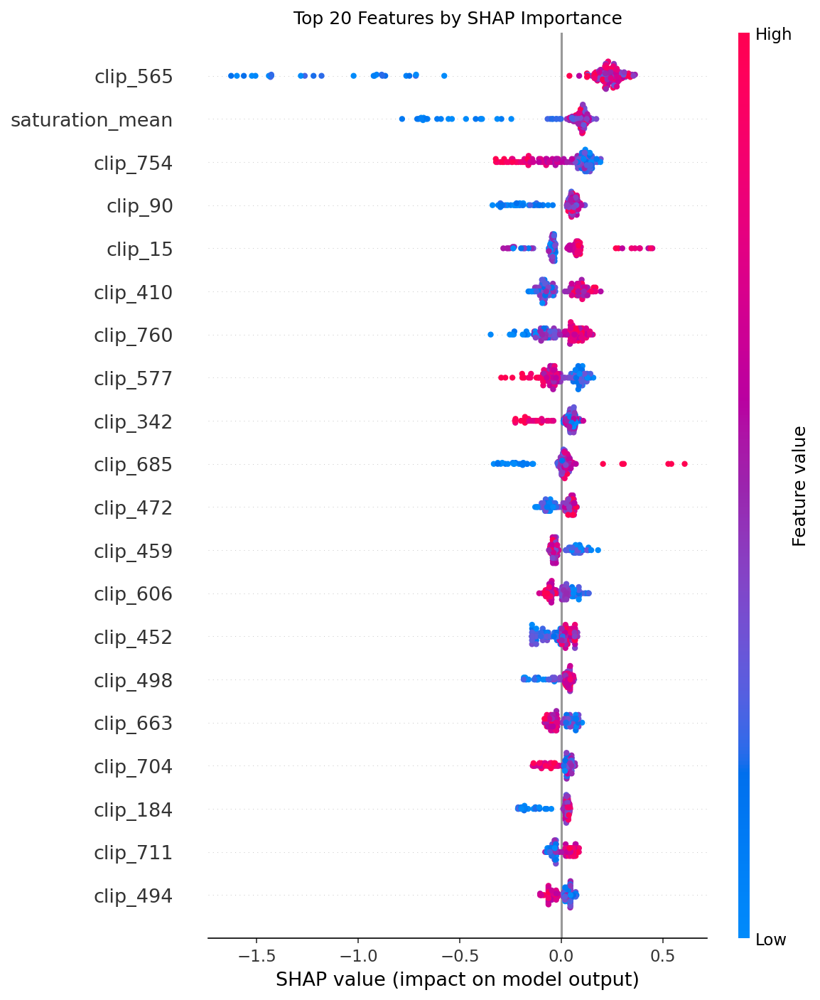
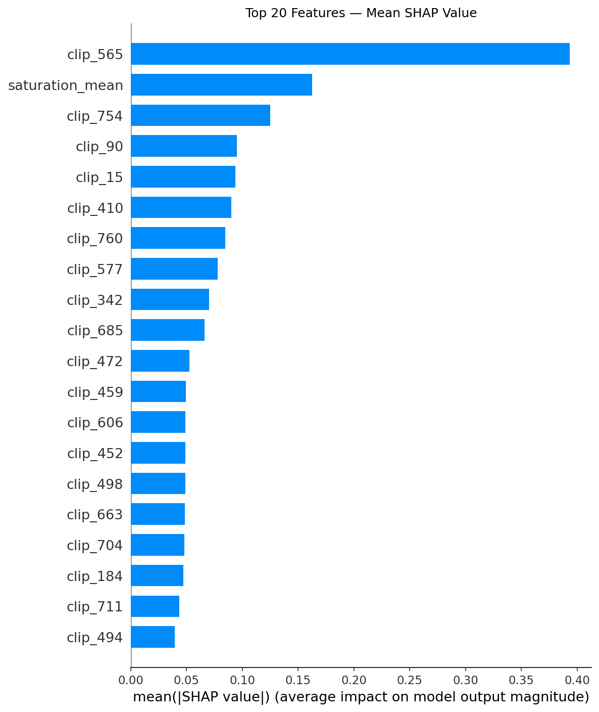

# ThumbnailIQ 🎯

> A machine learning system that predicts YouTube thumbnail Click-Through Rate (CTR) using computer vision and XGBoost.

## Live Demo
🚀 **[Try it here](https://huggingface.co/spaces/gaurav6767/thumbnailiq)** — upload any YouTube thumbnail and get an instant score + improvement tips.

## Problem Statement
YouTube creators upload 500+ hours of video every minute. A thumbnail is the #1 factor in whether someone clicks. This project builds a model that scores any thumbnail from 0–100 and gives actionable improvement suggestions — using only visual features.


1. **Data Collection** — YouTube Data API v3 (143 videos, 3 niches: Tech, Cooking, Gaming)
2. **Feature Extraction** — Color stats, Face detection, Text detection, CLIP embeddings
3. **Model Training** — XGBoost regression with SHAP explainability
4. **Demo App** — Gradio web app hosted on Hugging Face Spaces

## Features Extracted (806 total)
| Type | Tool | Features |
|---|---|---|
| Color | OpenCV | Brightness, contrast, saturation, colorfulness, dominant colors |
| Face | DeepFace | Face count, emotion scores, eye contact |
| Text | pytesseract | Word count, text area %, has numbers |
| Semantic | CLIP | 768-dim scene embedding |

## Results
| Metric | Score |
|---|---|
| MAE | 1.2681 |
| R² Score | 0.3204 |
| Spearman Rank | 0.5034 |
| Improvement over baseline | 32.8% |

## Key Findings
- **Saturation is the top human-readable feature** — colorful thumbnails get more clicks
- **CLIP embeddings dominate** the top 10 SHAP features — semantic scene content matters most
- Model explains **32.8% more variance** than a mean baseline using thumbnail visuals alone
- Data leakage was identified and fixed — view count and days were removed from features

## SHAP Feature Importance



## Tech Stack
| Tool | Purpose |
|---|---|
| YouTube Data API v3 | Data collection |
| OpenCV | Color feature extraction |
| DeepFace | Face and emotion detection |
| pytesseract | OCR text detection |
| CLIP | Semantic image embeddings |
| XGBoost | CTR regression model |
| SHAP | Model explainability |
| Gradio | Demo web app |

## Project Structure

thumbnailiq/
├── notebooks/
│   ├── collect_metadata.py
│   ├── download_thumbnails.py
│   ├── compute_labels.py
│   ├── extract_color.py
│   ├── extract_faces.py
│   ├── extract_text.py
│   ├── extract_clip.py
│   ├── merge_features.py
│   ├── train_model.py
│   ├── explain_model.py
│   ├── evaluate_model.py
│   └── app.py
├── config.py
└── requirements.txt

## How to Run Locally
```bash
git clone https://github.com/gaurav-9947/thumbnailiq
cd thumbnailiq
python -m venv venv
venv\Scripts\activate
pip install -r requirements.txt
python notebooks/collect_metadata.py
python notebooks/train_model.py
python notebooks/app.py
```

## Dataset
143 YouTube videos across Tech, Cooking, and Gaming categories collected via YouTube Data API v3. CTR proxy calculated as views divided by days since upload.

## Limitations
- Small dataset (143 videos) — larger dataset would improve R²
- CTR depends on channel size, topic, and posting time — thumbnail alone can't explain everything
- Real CTR data not publicly available — view velocity used as proxy
